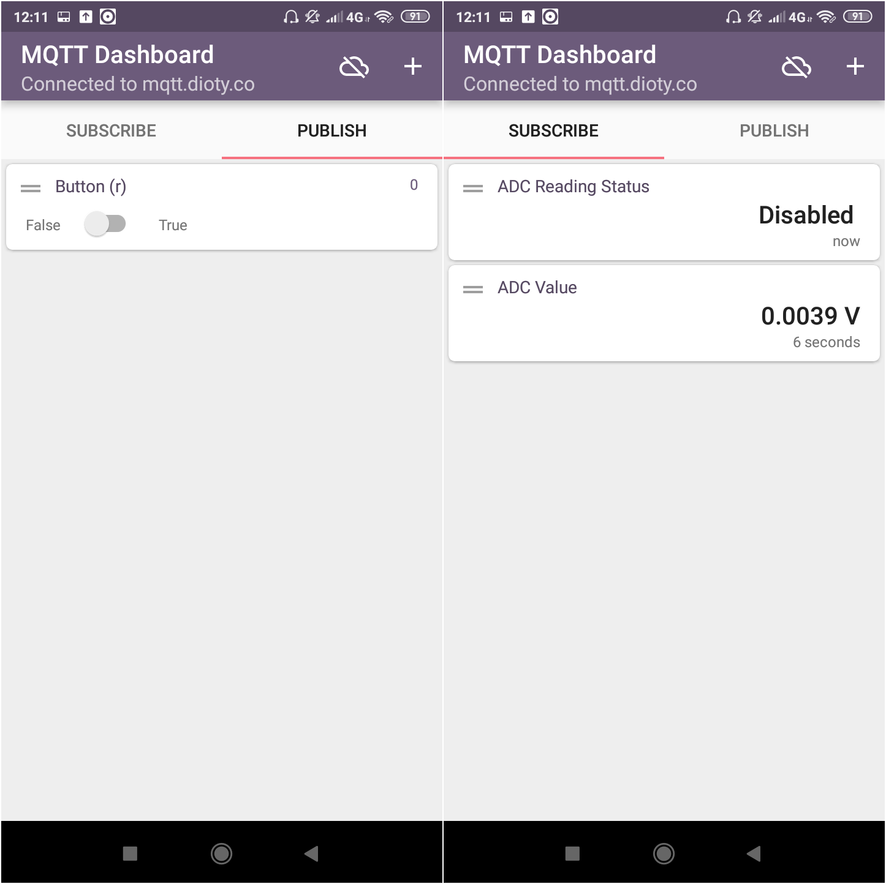
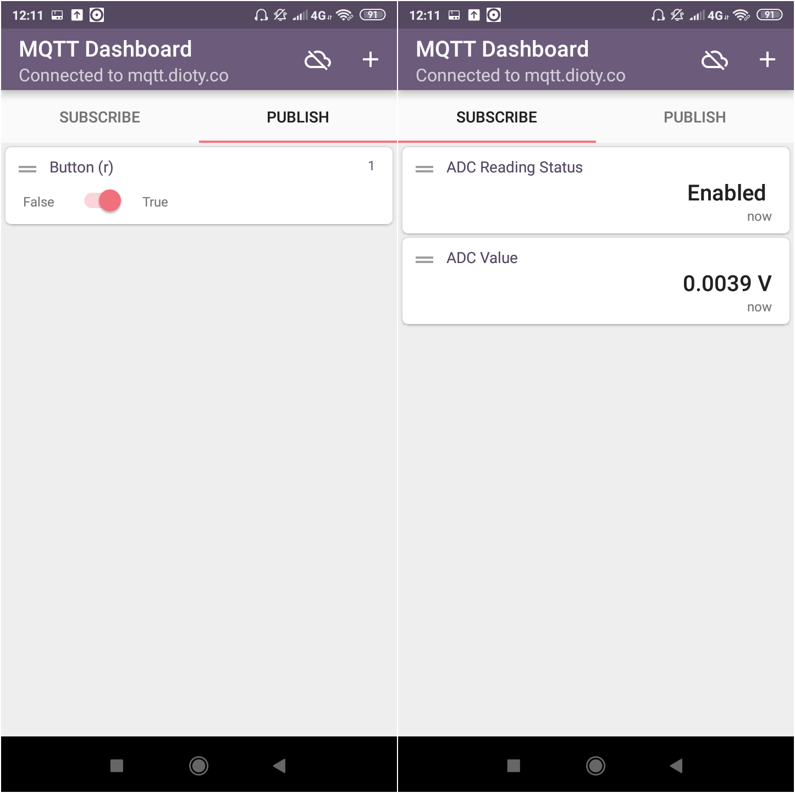

# ESP12-MQTT-IoT-Demo - An ESP-12 Demonstration for Sending and Receiving Data using MQTT Protocol

This project demonstrates a very simple implementation of ESP-12 to sending ADC reading and status, and receiving command from remote user through MQTT protocol. The sent data is just a floating ADC input reading and ADC reading status, and the received data from remote user is a command to enable/disable ADC reading.

Tested on Wemos D1 Mini and Arduino 1.8.9 IDE

## Dependencies
There are a few dependencies required:
* Arduino IDE
* [ESP8266 Core for Arduino](https://github.com/esp8266/Arduino). Please follow the installation instruction.
* [PubSubClient](https://github.com/knolleary/pubsubclient) library. Personally, I am using [this](https://github.com/knolleary/pubsubclient) library.

## Usage
* Please use your own **username, password, and mqtt broker service**, then put into:
```cpp
const char* brokerUser = "your_mqttBroker_username";
const char* brokerPass = "your_mqttBroker_pass";
const char* broker = "your_broker_server";
```
personally, i am using mqtt.dioty.co for the broker server.

* Put your **WiFi credentials** into:
```cpp
wifiMulti.addAP("ssid_from_AP_1", "your_password_for_AP_1");
wifiMulti.addAP("ssid_from_AP_2", "your_password_for_AP_2");
wifiMulti.addAP("ssid_from_AP_3", "your_password_for_AP_3");
```
you can whether use only one SSID and password or all of them.

* ADC values are reported into the `/out/adc` topic and the AC statuses are reported into the `/out/stat`.
* ADC enabling/disabling commands are received from the `/in` topic.

## In Action
Here, I am using the MQTT Dashboard Smartphone App to see the data and to control the Wemos D1 through MQTT protocol.

* First, we command the ADC to be disabled by sending `0` charachter into the `/in/` topic. The effects are Wemos will report ADC disabled into `/out/stat` topic and ADC voltage into `/into/adc` topic.


* Then, we command the Wemos to enabling the ADC by sending `1` character into the `/in/` topic.


## TODO
* Optimize the code (there is a lot of room for improvements!!)
* Adding capabitilies for controlling another I/O ports.
* ...

## Contributing
1. Fork it [https://github.com/handiko/ESP12-MQTT-IoT-Demo/fork](https://github.com/handiko/ESP12-MQTT-IoT-Demo/fork)
2. Create new branch (`git checkout -b myfeature`)
3. Do some editing / create new feature
4. Commit your works (`git commit -m "Adding some feature blah blah blah.."`)
5. Push to the branch (`git push -u origin myfeature`)
6. Create a new Pull Request
